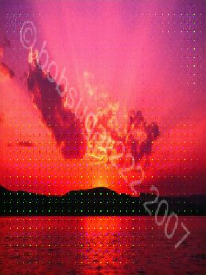
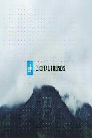

# Watermark removal from images
___
This repo contains codes for the image translation models.For this project we manually created a dataset of images with and without watermarks, this data is used to train Pix2Pix model.We collected around 40k images, these images are than were overlayed with transparent watermarks.Due to limited GPU resources, model was only trained for 15 epochs.

## Models
* Pix2Pix - Pix2Pix GAN implementation taken from tensorflow docs
* VGG_UNET - Pix2Pix model with pretrained VGG16 as the generator in the GAN, VGG16 was used as downsampler in U-Net.

## Results

   
   

Model can be [downloaded from here.](https://drive.google.com/drive/folders/1IEbUm-AUze-J1sZIkHD5CfOFpLQD3l52?usp=sharing)
